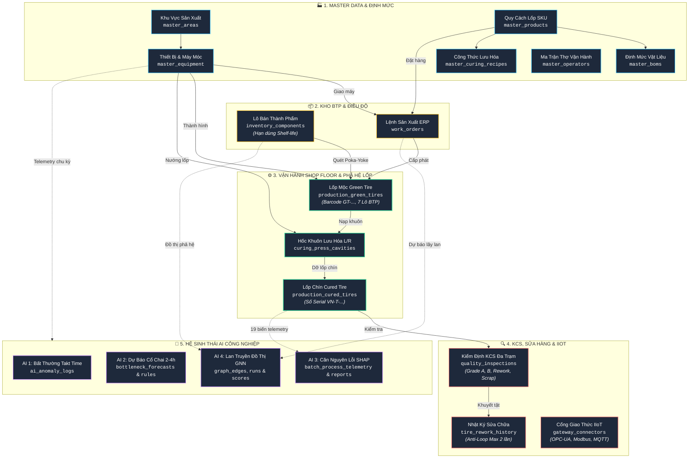
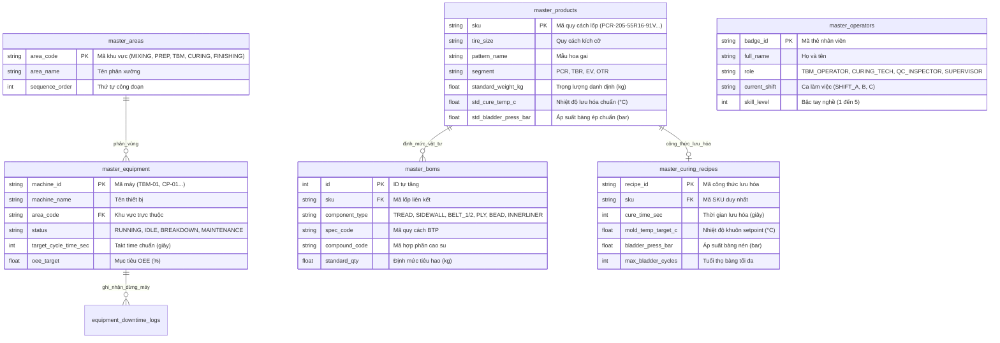
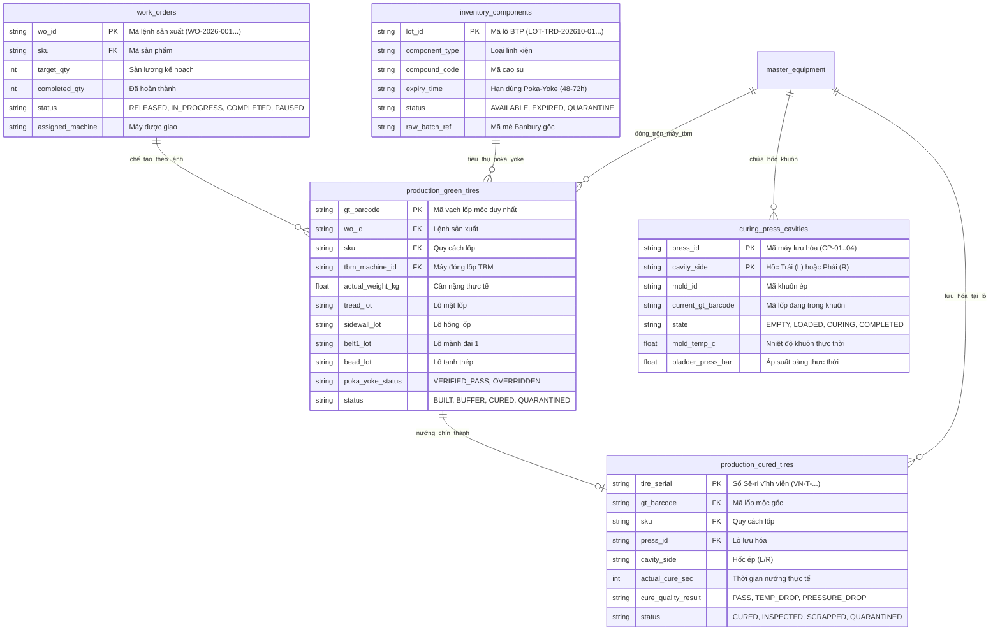
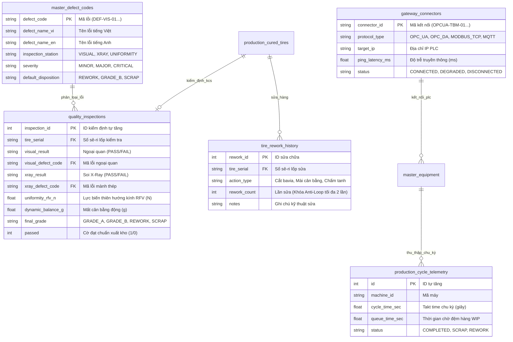
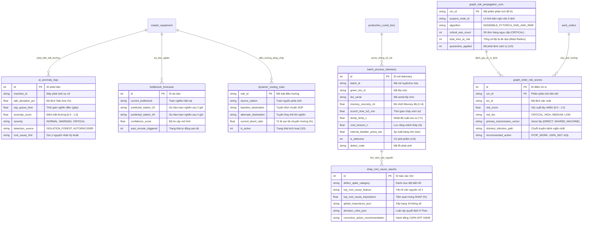

# Thiết Kế Kiến Trúc Cơ Sở Dữ Liệu TIRE-MES (Database Architecture & Modular ER Diagrams)

> **Tiêu chuẩn áp dụng:** ANSI/ISA-95 Level 3 (MOM / MES), MESA-11, IATF 16949 Section 8.5.2 & Section 8.7.  
> **Động cơ CSDL:** SQLite 3 Engine hiệu năng cao (Chế độ WAL, Busy Timeout 60s, Phân tách Read-Replica chỉ đọc).

---

## 1. Sơ Đồ Dòng Chảy Kiến Trúc Mức Cao (Level 0: High-Level Architecture Flowchart)

Thay vì nhìn vào một sơ đồ mạng nhện rối rắm, sơ đồ phân tầng dưới đây mô tả trực quan **luồng vận hành tổng thể** kết nối 27 bảng dữ liệu thành 5 khối chức năng liền mạch:



---

## 2. Các Sơ Đồ ER Phân Hệ Chuyên Biệt (Level 1: Modular Domain ERDs)

Nhằm giúp kỹ sư dễ dàng quan sát, phân tích và truy vấn, 27 bảng dữ liệu được tách thành **4 sơ đồ thực thể độc lập** theo từng miền nghiệp vụ:

### Phân Hệ A: Master Data, Sản Phẩm & Định Mức Kỹ Thuật (BOM & Recipes)
Tập trung vào dữ liệu tĩnh, cấu trúc thiết bị và công nghệ sản xuất:



---

### Phân Hệ B: Dòng Chảy Vận Hành Sản Xuất & Phả Hệ Lốp (Core Lineage & Digital Tire Passport)
**Đây là xương sống quan trọng nhất của hệ thống MES**, quản lý việc biến 7 lô nguyên liệu thành lốp mộc và khắc số serial vĩnh viễn:



---

### Phân Hệ C: Kiểm Soát Chất Lượng KCS, Sửa Hàng & IIoT Gateway
Đảm bảo chất lượng xuất xưởng theo chuẩn IATF 16949 và kết nối tự động hóa:



---

### Phân Hệ D: Hệ Sinh Thái Trí Tuệ Nhân Tạo (Industrial AI Ecosystem)
Bộ tứ động cơ AI bảo vệ toàn diện năng suất, chất lượng và phả hệ nhà máy:



---

## 3. Ma Trận Tra Cứu Liên Kết Khóa Ngoại 1 Phút (Quick Reference Matrix)

| Bảng Nguồn (Chứa Khóa Ngoại) | Cột Khóa Ngoại (FK) | Bảng Đích (Khóa Chính PK) | Mối Quan Hệ Nghiệp Vụ Thực Tế |
| :--- | :--- | :--- | :--- |
| `master_equipment` | `area_code` | `master_areas(area_code)` | Máy móc thuộc phân xưởng sản xuất nào (Mixing, TBM, Curing...) |
| `master_boms` | `sku` | `master_products(sku)` | Định mức 7 linh kiện cấu thành nên quy cách lốp |
| `master_curing_recipes` | `sku` | `master_products(sku)` | Công thức nhiệt, áp, thời gian lưu hóa riêng cho từng mã lốp |
| `work_orders` | `sku` | `master_products(sku)` | Đơn hàng chỉ định sản xuất loại lốp nào |
| `production_green_tires` | `wo_id` | `work_orders(wo_id)` | Lốp mộc được lắp ráp thuộc lệnh sản xuất nào |
| `production_green_tires` | `sku` | `master_products(sku)` | Quy cách kỹ thuật lốp mộc |
| `production_green_tires` | `tbm_machine_id` | `master_equipment(machine_id)` | Đóng trên máy thành hình TBM nào (VMI MAXX) |
| `production_green_tires` | `operator_id` | `master_operators(badge_id)` | Thợ thành hình chịu trách nhiệm tay nghề |
| `curing_press_cavities` | `press_id` | `master_equipment(machine_id)` | Hốc khuôn Trái/Phải thuộc cụm lò lưu hóa nào |
| `production_cured_tires` | `gt_barcode` | `production_green_tires(gt_barcode)` | **Khóa phả hệ 100%**: Lốp chín ra lò từ chiếc lốp mộc nào |
| `production_cured_tires` | `press_id` | `master_equipment(machine_id)` | Lò lưu hóa thực hiện nướng chín |
| `quality_inspections` | `tire_serial` | `production_cured_tires(tire_serial)` | Kết quả KCS thuộc về số sê-ri lốp duy nhất nào |
| `quality_inspections` | `visual_defect_code` | `master_defect_codes(defect_code)` | Mã lỗi ngoại quan theo thư viện tiêu chuẩn |
| `quality_inspections` | `xray_defect_code` | `master_defect_codes(defect_code)` | Mã lỗi soi mành thép X-Ray |
| `quality_inspections` | `inspector_id` | `master_operators(badge_id)` | KCS viên ký duyệt chất lượng |
| `tire_rework_history` | `tire_serial` | `production_cured_tires(tire_serial)` | Lốp nào đang được đưa vào luồng sửa chữa |
| `equipment_downtime_logs` | `machine_id` | `master_equipment(machine_id)` | Ghi nhận thời gian dừng máy tính toán OEE |
| `graph_order_risk_scores` | `run_id` | `graph_risk_propagation_runs(run_id)` | Điểm rủi ro lây lan thuộc phiên quét AI nào |

---

## 4. Từ Điển Dữ Liệu Chi Tiết 27 Bảng (Thu Gọn Tiện Tra Cứu)

<details>
<summary>▶ Bấm để mở Từ Điển Dữ Liệu Chi Tiết Của Toàn Bộ 27 Bảng</summary>

### 1. Bảng `master_areas`
| Cột | Kiểu | Ràng buộc | Ý nghĩa nghiệp vụ |
| :--- | :--- | :--- | :--- |
| `area_code` | TEXT | PRIMARY KEY | Mã khu vực (MIXING, PREP, TBM, CURING, FINISHING, WAREHOUSE) |
| `area_name` | TEXT | NOT NULL | Tên phân xưởng hiển thị |
| `description` | TEXT | NULL | Chức năng công nghệ |
| `sequence_order` | INTEGER | NOT NULL | Thứ tự công đoạn trong luồng sản xuất ISA-95 |

### 2. Bảng `master_equipment`
| Cột | Kiểu | Ràng buộc | Ý nghĩa nghiệp vụ |
| :--- | :--- | :--- | :--- |
| `machine_id` | TEXT | PRIMARY KEY | Mã định danh thiết bị (TBM-01, CP-01, MIX-01...) |
| `machine_name` | TEXT | NOT NULL | Tên máy móc |
| `area_code` | TEXT | FK -> master_areas | Khu vực trực thuộc |
| `status` | TEXT | CHECK IN (...) | Trạng thái: RUNNING, IDLE, BREAKDOWN, CHANGEOVER, MAINTENANCE |
| `cavities_count` | INTEGER | DEFAULT 1 | Số hốc ép (1 hoặc 2) |
| `target_cycle_time_sec`| INTEGER | DEFAULT 60 | Takt time chuẩn (giây) |
| `oee_target` | REAL | DEFAULT 85.0 | Mục tiêu OEE (%) |

### 3. Bảng `master_products`
| Cột | Kiểu | Ràng buộc | Ý nghĩa nghiệp vụ |
| :--- | :--- | :--- | :--- |
| `sku` | TEXT | PRIMARY KEY | Mã sản phẩm duy nhất (PCR-205-55R16-91V...) |
| `tire_size` | TEXT | NOT NULL | Quy cách kích cỡ lốp xe |
| `pattern_name` | TEXT | NOT NULL | Tên mẫu gai lốp |
| `segment` | TEXT | CHECK IN (...) | Phân khúc: PCR, TBR, EV, OTR |
| `standard_weight_kg` | REAL | NOT NULL | Trọng lượng tiêu chuẩn (kg) |
| `weight_tolerance_kg`| REAL | DEFAULT 0.25 | Dung sai trọng lượng cho phép (+/- kg) |
| `std_cure_temp_c` | REAL | DEFAULT 170.0 | Nhiệt độ lưu hóa danh định (°C) |
| `std_bladder_press_bar`| REAL | DEFAULT 21.0 | Áp suất bàng lưu hóa danh định (bar) |

### 4. Bảng `inventory_components`
| Cột | Kiểu | Ràng buộc | Ý nghĩa nghiệp vụ |
| :--- | :--- | :--- | :--- |
| `lot_id` | TEXT | PRIMARY KEY | Mã vạch lô bán thành phẩm (LOT-TRD-202610-01...) |
| `component_type` | TEXT | CHECK IN (...) | TREAD, SIDEWALL, BELT_1/2, PLY, BEAD, INNERLINER |
| `compound_code` | TEXT | NOT NULL | Mã hỗn luyện cao su |
| `produced_time` | TEXT | NOT NULL | Thời điểm xuất xưởng BTP |
| `expiry_time` | TEXT | NOT NULL | **Hạn dùng Poka-Yoke (Shelf-life 48-72h)** |
| `remaining_qty` | INTEGER | DEFAULT 50 | Số lượng cuộn/khay còn trong kho sàn |
| `status` | TEXT | CHECK IN (...) | AVAILABLE, RESERVED, EXPIRED, DEPLETED, QUARANTINE |
| `raw_batch_ref` | TEXT | NOT NULL | Mã mẻ luyện kín Banbury gốc phục vụ truy xuất ngược |

### 5. Bảng `work_orders`
| Cột | Kiểu | Ràng buộc | Ý nghĩa nghiệp vụ |
| :--- | :--- | :--- | :--- |
| `wo_id` | TEXT | PRIMARY KEY | Mã lệnh sản xuất (WO-2026-001...) |
| `sku` | TEXT | FK -> master_products | Quy cách lốp cần đóng |
| `target_qty` | INTEGER | NOT NULL | Sản lượng mục tiêu |
| `completed_qty` | INTEGER | DEFAULT 0 | Sản lượng hoàn thành |
| `scrap_qty` | INTEGER | DEFAULT 0 | Số lốp phế phẩm |
| `status` | TEXT | CHECK IN (...) | PLANNED, RELEASED, IN_PROGRESS, COMPLETED, PAUSED |
| `assigned_machine` | TEXT | NULL | Máy đóng lốp được phân bổ (TBM-01, TBM-02) |

### 6. Bảng `production_green_tires`
| Cột | Kiểu | Ràng buộc | Ý nghĩa nghiệp vụ |
| :--- | :--- | :--- | :--- |
| `gt_barcode` | TEXT | PRIMARY KEY | Mã vạch lốp mộc duy nhất (GT-YYYYMMDD-XXXX) |
| `wo_id` | TEXT | FK -> work_orders | Lệnh sản xuất trực thuộc |
| `sku` | TEXT | FK -> master_products | Mã quy cách lốp |
| `tbm_machine_id` | TEXT | FK -> master_equipment | Máy thành hình TBM |
| `operator_id` | TEXT | FK -> master_operators | Thợ đóng lốp |
| `actual_weight_kg` | REAL | NOT NULL | Khối lượng cân thực tế |
| `tread_lot` | TEXT | NOT NULL | Lô mặt lốp quét Poka-Yoke |
| `sidewall_lot` | TEXT | NOT NULL | Lô hông lốp quét Poka-Yoke |
| `belt1_lot` | TEXT | NOT NULL | Lô mành đai 1 quét Poka-Yoke |
| `belt2_lot` | TEXT | NOT NULL | Lô mành đai 2 quét Poka-Yoke |
| `ply_lot` | TEXT | NOT NULL | Lô mành thân quét Poka-Yoke |
| `bead_lot` | TEXT | NOT NULL | Lô tanh thép quét Poka-Yoke |
| `innerliner_lot` | TEXT | NOT NULL | Lô màng kín khí quét Poka-Yoke |
| `poka_yoke_status`| TEXT | DEFAULT 'VERIFIED_PASS'| Trạng thái xác thực chống nhầm |
| `status` | TEXT | CHECK IN (...) | BUILT, BUFFER, IN_CURING, CURED, SCRAPPED, QUARANTINED |

### 7. Bảng `production_cured_tires`
| Cột | Kiểu | Ràng buộc | Ý nghĩa nghiệp vụ |
| :--- | :--- | :--- | :--- |
| `tire_serial` | TEXT | PRIMARY KEY | **Số Sê-ri lốp duy nhất vĩnh viễn (VN-T-...)** |
| `gt_barcode` | TEXT | FK -> production_green_tires | Mã lốp mộc liên kết 100% |
| `sku` | TEXT | FK -> master_products | Mã quy cách sản phẩm |
| `press_id` | TEXT | FK -> master_equipment | Máy lưu hóa thực hiện nướng |
| `cavity_side` | TEXT | CHECK IN ('L', 'R') | Hốc khuôn Trái (L) hoặc Phải (R) |
| `actual_cure_sec` | INTEGER | NOT NULL | Tổng thời gian nén nhiệt thực tế |
| `avg_mold_temp_c` | REAL | NOT NULL | Nhiệt độ khuôn đo thực tế |
| `avg_bladder_press_bar`| REAL | NOT NULL | Áp suất bàng nén thực tế |
| `cure_quality_result`| TEXT | NOT NULL | PASS, TEMP_DROP, PRESSURE_DROP, OVER_CURE |
| `status` | TEXT | CHECK IN (...) | CURED, INSPECTED, SCRAPPED, REWORK, QUARANTINED |

### 8. Bảng `quality_inspections`
| Cột | Kiểu | Ràng buộc | Ý nghĩa nghiệp vụ |
| :--- | :--- | :--- | :--- |
| `inspection_id` | INTEGER | PRIMARY KEY AUTOINCREMENT | Khóa chính tự tăng |
| `tire_serial` | TEXT | FK -> production_cured_tires | Số sê-ri lốp kiểm tra KCS |
| `visual_result` | TEXT | CHECK IN ('PASS', 'FAIL') | Kết quả ngoại quan |
| `visual_defect_code`| TEXT | FK -> master_defect_codes | Mã lỗi ngoại quan |
| `xray_result` | TEXT | CHECK IN ('PASS', 'FAIL') | Kết quả soi mành X-Ray |
| `xray_defect_code` | TEXT | FK -> master_defect_codes | Mã lỗi kết cấu mành |
| `uniformity_rfv_n` | REAL | NOT NULL | Lực biến thiên hướng kính RFV (N) |
| `dynamic_balance_g`| REAL | NOT NULL | Độ mất cân bằng động (g) |
| `final_grade` | TEXT | CHECK IN (...) | GRADE_A (OEM), GRADE_B, REWORK, SCRAP |
| `passed` | INTEGER | CHECK IN (0, 1) | Cờ đạt chuẩn xuất xưởng |

### 9. Bảng `tire_rework_history`
| Cột | Kiểu | Ràng buộc | Ý nghĩa nghiệp vụ |
| :--- | :--- | :--- | :--- |
| `rework_id` | INTEGER | PRIMARY KEY AUTOINCREMENT | Khóa chính tự tăng |
| `tire_serial` | TEXT | FK -> production_cured_tires | Số sê-ri lốp đưa vào sửa chữa |
| `action_type` | TEXT | CHECK IN (...) | Cắt bavia, Mài cân bằng, Chấm tanh |
| `rework_count` | INTEGER | NOT NULL | **Số lần sửa lũy kế (Tối đa 2 lần)** |

*(Chi tiết 18 bảng còn lại về SCADA Telemetry, AI Anomaly, Dynamic Bottleneck, XAI SHAP và Graph ML Contagion được định nghĩa tương tự trong mã nguồn [`app/database.py`](../app/database.py)).*
</details>

---

## 5. Tối Ưu Chịu Tải Cao (High-Concurrency Tuning in Practice)

Để xử lý hàng nghìn lượt quét mã vạch mỗi phút trên sàn xưởng lốp mà không bị tắc nghẽn giao dịch, hệ thống áp dụng các tham số nhân SQLite:

1. **Chế Độ Ghi Nhật Ký WAL (Write-Ahead Logging):**
   ```sql
   PRAGMA journal_mode = WAL;
   PRAGMA synchronous = NORMAL;
   PRAGMA cache_size = -64000; -- 64MB Bộ nhớ đệm RAM
   ```
   * *Ý nghĩa:* Tách biệt luồng Đọc và Ghi. Các truy vấn báo cáo Dashboard và AI **hoàn toàn không khóa** thao tác ghi mã vạch của công nhân tại trạm máy TBM & Curing.

2. **Chống Treo Khóa Giao Dịch (Busy Timeout Interlock):**
   ```sql
   PRAGMA busy_timeout = 60000; -- Chờ tối đa 60 giây trước khi báo lỗi
   ```
   * *Ý nghĩa:* Loại bỏ triệt để lỗi `database is locked` khi hàng chục đầu đọc mã vạch quét đồng thời lúc giao ca.

3. **Phân Tách Read-Replica Chỉ Đọc:**
   * Dashboard điều hành SCADA và các tác vụ trích xuất báo cáo kết nối bằng cờ `SQLITE_OPEN_READONLY`, đảm bảo an toàn tuyệt đối cho Database Transactional chính.
